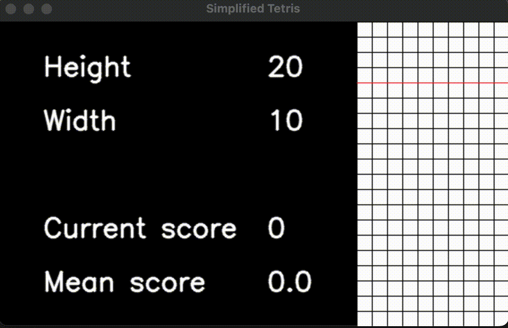

# Tetris AI
> A trained AI model that plays the game of Tetris 🧩

  

## What is Tetris?
Tetris is a puzzle game where one of seven shapes (called Tetriminoes) fall from the top of a game board (10 wide and 20 tall). Players must move and rotate these pieces so that they create full rows, which then are deleted from the board. Clearing rows scores points while building to the top of the board would result in a game over.

## Previous Work (Existing Environment)

For this project, I used the Tetris client from OliverOverend:
https://github.com/OliverOverend/gym-simplifiedtetris
- However, I don't believe this link works anymore and I could not find the repo online.
- I am using the `gym_simplifiedtetris` package from Oliver.

The above repo provides a Tetris environment that can be utilized to extract state features and data. For this project, I am using the `gym_simplifiedtetris` package as it provides access to key game metrics built-in. In addition, this environment greatly simplifies the decision state of the game as each next state is a position a Tetrimino can move and lock into, not where it may fall by gravity.

## Agents
### Random Agent
Chooses moves based on a random sample of the current action space.

### Heuristic Agent
Chooses moves based on specific state features.

For this problem, I found three optimal set of features that could be used. The most common is **Dellacherie's Algorithm**:

| Feature | Description |
| ------- | ----------- |
| **Landing Height** | The height where the latest piece is put. |
| **Eroded Pieces/Rows Eliminated** | (# rows eliminated) * (# cells the piece contributed to eliminating the rows) |
| **Board Row Transitions** | The total number of row transitions. A row transition occurs when an empty cell is adjacent to a filled cell on the same row and vice versa. |
| **Board Column Transitions**  | The total number of column transitions. A column transition occurs when an empty cell is adjacent to a filled cell on the same column and vice versa. |
| **Board Buried Holes** | Number of empty cells below at least one filled cell in the same column. |
| **Board Wells** | Amount of empty cells in succession where their left and right cells are filled. |

A more advanced algorithm called **Building Controllers for Tetris** (BCTS) incorporates two additional heuristics on top of Dellacherie's Algorithm:

| Feature | Description |
| ------- | ----------- |
| **<i>(in addition to Dellacherie's)...</i>** | |
| **Hole Depth** | Sum of full squares in the column above each hole. |
| **Rows with Holes** | Number of rows with gaps (holes) between lowest and highest placed piece. |

An **alternative feature-based learning algorithm** used similar, but less features:

| Feature | Description |
| ------- | ----------- |
| **Aggregate Height** | Sum of heights of each column. |
| **Rows Eliminated** | Number of columns eliminated so far |
| **Board Buried Holes** | Number of empty cells below at least one filled cell in the same column. |
| **Bumpiness** | The variation in column heights. Computed by summing the absolute difference between all two adjacent columns. |

#### Understanding these heuristics

In the game of Tetris, your score is determined by the number of lines (rows) cleared. Thus, the highest priority is keeping a good board state and clearing lines as efficiently as possible. These heuristics maximize this potential by keeping the board low to the ground (reducing the risk of toppling over) and priortizing Tetrimino placements that would keep the upper-most level smooth (which maximizes the potential "good" piece placements).

#### References for Heuristic Agent features
- https://imake.ninja/el-tetris-an-improvement-on-pierre-dellacheries-algorithm/ (El-Tetris, an improvement on Dellacherie's algorithm)
- https://openbase.com/python/pytetris/documentation#pierre-dellacherie (Explanation of Dellacherie's algorithm)
- https://www.colinfahey.com/tetris/tetris.html (History of Tetris implementations)
- https://mcgovern-fagg.org/amy_html/courses/cs5033_fall2007/Lundgaard_McKee.pdf (Explanation of Dellacherie's algorithm)
- https://codemyroad.wordpress.com/2013/04/14/tetris-ai-the-near-perfect-player/ (Another take on a feature-based learning algorithm)
- http://cs231n.stanford.edu/reports/2016/pdfs/121_Report.pdf (Learning in Tetris)
- https://arxiv.org/pdf/1905.01652.pdf (Recommends weights for Dellacherie's: -4 holes, -1 for all but +1 for eroded cells; BCTS algorithm)

## Training

The weights for these heuristics were calculated using genetic learning. Initially, the weights were influenced and manually chosen based on the articles above. Afterwards, various game environments were set up with randomized weights, and those that scored the highest points would have influence in the next weights to select.

## Results

After running each model for 10 iterations, the BCTS algorithm yielded a mean score of 450.3 whereas Dellacherie's Algorithm yielded a mean score of 844.3 (with a standard deviation of 961.5). Even though BCTS includes extra heuristics, it performs notably worse.

#### Current Limitations

Currently, these Tetris AIs are running on a classic-based Tetris environment. This means that features like 7-bag have not been implemented, which would normally force a Tetrimino to appear at least once every 14 pieces. Thus, it is possible for runs to end early if there is a spree of bad pieces (like S or Z pieces back-to-back).

In addition, these Tetris AIs are not good at downstacking. Even though they prioritize not building high, once they do, they struggle to clear back down. Thus, it's almost like how high an AI has built is like it's HP (health points, like stamina) - once it goes too high there's no way back.

## Manually Running
1. First, create a Conda environment using the `environment.yml` file.
    - `conda create --name tetris-ai --file environment.yml`
2. Open the repo in PyCharm
    - I'm not sure if this step is necessary, but I was having difficulties loading the `gym_simplifiedtetris` package otherwise.
3. Go to `learningAgents/heuristic/runHeuristicAgent.py` and run it
   - In PyCharm, click the green arrow in the top-right
4. There should be a pop-up of the game similar to the gif above

## Directory Breakdown

`/gym_simplifiedtetris` - Game package directory (can pip install)
    - handles visualizing and processing game

`/learningAgents` - learning algorithm implementations

## Notes

- Game speed can be adjusted at:
    `gym_simplifiedtetris/envs/simplified_tetris_engine.py`` -> `self._sleep_time = 1` (lower is faster)

## TODOs:

- [ ] Explore a Q-Learning agent
- [ ] Re-attempt genetic learning with more powerful hardware on a 10x20 board
- [ ] Implement competitive modern Tetris rules into the game engine
    - It would be interesting to see how long they would last against each other
